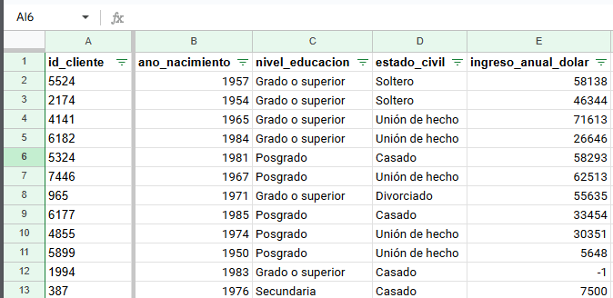
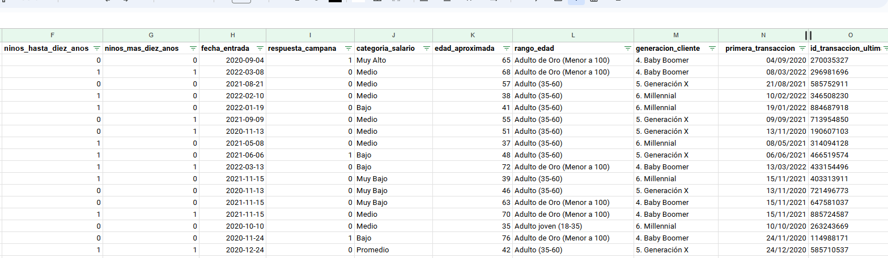
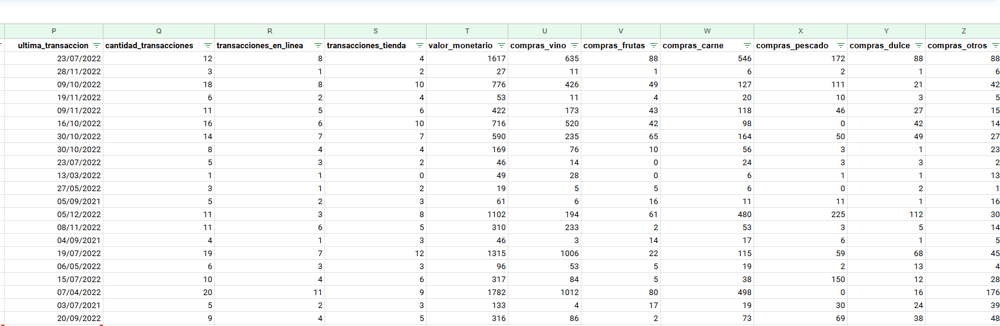
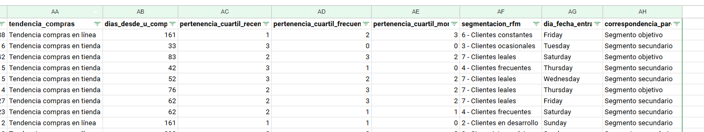

# Proyecto de Análisis de Datos.
## Segmentación Proyecto 1 

### Objetivos:

Preparar la información de la base de datos y aplicar la segmentación de clientes a través de RFM, entender el resultado de la segmentación  y sacar conclusiones que posibiliten a la empresa a tomar decisiones, las cuales son requeridas por parte de la empresa para mantener y aumentar sus ingresos, además buscar información importante que se encuentra oculta en los datos.

Se pretende responder las preguntas relacionadas a quienes son nuestros clientes, y como se comportan los mismos con la empresa. 
Se pretende responder:
* Cuál es el grado academico de los clientes?
* Cual es la edad de estos?
* Cuántos tienen hijos?
* Cual es la tendencia de compra del cliente?
* Quienes son los clientes que generan el 80% de los ingresos de la empresa?
* otras preguntas relacionadas...

### Equipo:

Osiris Berbesia - Individual

### Herramientas y Tecnologías:

* Hojas de cálculo Excel
    * Documentación de Google Sheets
* OpenAI - ChatGPT
* Looker Studio
* Google Slides
* YouTube

### Procesamiento y análisis:

#### Procesamiento

* Antes de la exploración de datos, se importan los datos de los tres data_sets recibidos en un solo documento con la formula IMPORTRANGE.
* Una vez realizada la importación de datos, se procede a la busqueda de nulos para tomar decisiones acerca de que hacer con estos.
* Para los data_set clientes, transacciones, y resumen se agregará una columna adicional para la formula "countblank" y así poder determinar con mejor exactitud cuales acciones tomar
    * Para el data_set clientes, la categoria ingreso_anual_dolar tiene un total de 24 clientes con esta información en nulo, en este data_set, para no eliminar a los clientes, se establecerá un valor de -1 de forma que:
        - Todos los clientes que tengan valor -1 en su ingreso_anual_dolar, serán excluidos de la promediación del ingreso anual, ya que, pueden existir usuarios que al registrarse, indiquen que su ingreso anual es 0, por lo que si se le pone 0 a estos nulos, luego se confundiría la información entre los que dejaron vacio y los que llenaron nulos. 
    * Para el data_set transacciones, existen los siguientes nulos:
    
    Los cuales, al no tener el ID del cliente ni otra fuente de datos para recuperar la información faltante, se decide omitir estos.
    * Para el data_set resumen_compras, no existe ninguna categoria con nulos. Por lo cual se trabajará con la información de todo el data set según aplique.
    * * Para los data_sets que tienen nulos y se deben modificar a  -1 y 0 según lo explicado anteriormente, al ser data_sets importados, no se puede modificar la información dentro de ellos, por lo cual se hará una columna adicional, donde se recorra cada categoria donde están los nulos y modifique los datos a -1 o 0 según corresponda la ubicación del nulo, y se trabajará con esta columna auxiliar.
* En cuanto a los valores duplicados, se examinan los 3 data_sets, y en las categorias donde no pueden (no deberían) haber duplicados, son:
    * En el data_set clientes, el valor que debería ser siempre único, es id_cliente, para este data_set, no hay valores duplicados.
    * En el data_set transacciones, el único valor que no debería estar duplicado sería, id_transacción, el cual no está duplicado.
        * id_cliente si se repite, sin embargo, es totalmente válido en este escenario.
    * En resumen_compras, el valor id_cliente, está duplicado, y para este escenario, el valor no debería de estarlo. Se podría evaluar hacer la suma de los montos, si estos fueran diferentes, pero en este caso, desde ID hasta el último dato, todo esta duplicado, por lo cual en este caso los valores duplicados si deben eliminarse, sin embargo, al tratarse de información extraida con IMPORTRANGE no se puede eliminar esto, sin embargo se decide no tomarlos en cuenta.

* Valores fuera del alcance del análisis, para el data set transacciones, las transacciones que no tengan id_cliente, son valores fuera del alcance del análisis.

Para cambiar los valores a -1 en el data set donde corresponde la sustitución de la información por lo valores nulos, se utiliza una función que recorra y corrobore donde hay nulos para sustituirlos por los valores comentados.
Para el data set tranasacciones, se realiza una query que traiga los datos del origen sin los nulos.
=QUERY(IMPORTRANGE("https://docs.google.com/spreadsheets/d/1dD2UF-XPWjPu7pkApGCQ1uIIVA0gAcZ-Qk4LPmxX10A/edit","transacciones!A:D"), "SELECT * WHERE Col1 IS NOT NULL AND Col2 IS NOT NULL AND Col3 IS NOT NULL AND Col4 IS NOT NULL", 1)

Para el data set resumen compras, se utiliza la función UNIQUE para eliminar los valores duplicados a nivel vista, ya que no estaremos trabajando con ellos, y son iguales de principio a fin.

=UNIQUE(IMPORTRANGE("https://docs.google.com/spreadsheets/d/1Tkg0lYsAiwu6CB6slktwUMdayWTvBq80SyX16r-xEVA/edit","resumen_compras!A:G"))

Otro valor fuera del alcance del análisis sería el id_transaccion, ya que es un dato no requerido para el análisis.

##### Nuevas variables:

###### Variables en hoja unificado:

* categoria_salario: es la promediación de los salarios para conocer en cual rango salarial está nuestro cliente
* edad_aproximada: es la edad del cliente tomando en cuenta que estamos al 31-Dic-2022
* rango_edad: segmenta al cliente en una categoria específica, según su edad
* generacion_cliente: define generación del cliente según el año de nacimiento
* primera_transaccion: fecha según registros de que el cliente hizo la primera transacción con nosotros
* ultima_transaccion: última fecha de transacción del cliente en el negocio
* cantidad_transacciones: cantidad total de transacciones del cliente en el negocio
* transacciones_en_linea: cuantas transacciones del cliente han sido en linea
* transacciones_tienda: cuantas transacciones del cliente han sido en tienda
* valor_monetario: valor total de las compras hechas por el cliente
* tendencia_compras: la tendencia específica del cliente según su actividad con el negocio
* dias_desde_u_compra: la cantidad de días que han pasado desde la última compra del cliente, si este dato no se tiene, el valor regresado es "1" el cual se muestra como N/A en la hoja de cálculo
* pertenencia_cuartil_recencia: pertenecencia del cliente en calificacion de 0-3 donde 0 se puntua a la pertenecencia del cuartil menos beneficioso para la empresa y 3 sería la calificación otorgada para el cuartil con mayor beneficiencia para el negocio
* pertenencia_cuartil_frecuecia:pertenecencia del cliente en calificacion de 0-3 donde 0 se puntua a la pertenecencia del cuartil menos beneficioso para la empresa y 3 sería la calificación otorgada para el cuartil con mayor beneficiencia para el negocio.
* pertenencia_cuartil_money:pertenecencia del cliente en calificacion de 0-3 donde 0 se puntua a la pertenecencia del cuartil menos beneficioso para la empresa y 3 sería la calificación otorgada para el cuartil con mayor beneficiencia para el negocio. 
* segmentacion_rfm: segmenta a los clientes segun la calificación obtenida según la pertenecencia del cuartil. Según la puntuación la segmentación puede ser:
    Valor 0=  "Sin registros mínimos"
    Valor 1=  "Clientes durmientes"
    Valor 2=  "Clientes en desarrollo"
    Valor 3=  "Clientes ocasionales"
    Valor 4=  "Clientes frecuentes"
    Valor 5=  "Clientes fieles"
    Valor 6=  "Clientes constantes"
    Valor 7=  "Clientes leales"
    Valor 8=  "Clientes premium"
    Valor 9=  "Top Clientes"
* dia_fecha_entrada: según la fecha de entrada del cliente al sistema, regresa el día de la semana a la que pertenece esta fecha.
* correspondencia_pareto: indica a cual segmento pertenece el cliente, si es nuestro segmento objetivo, o si es un segmento secundario.
* cantidad_hijos: representa la cantidad total de hijos que tiene el cliente

###### Variables en hito_2
* transaccion_01 - hasta el numero 30: muestra la fecha de la transacción, según el número de transacción. 
* meses_desde_1 hasta el número 30: indica la cantidad de meses que paso desde el registro hasta esa transacción
* cohor_ano_entrada: extrae el año de registro del cliente
* cohor_mes_entrada: extrae el mes de registro del cliente
* cohor_ano_primera_t: extrae el año de la primera transacción
* cohor_mes_primera_t: extrae el mes de la primera transacción
* ano_mes_entrada: cadena concatenada para agrupar a los clientes en cohorts específicos
* promedio_meses_compra_cliente: promedia la cantidad de meses entre transacciones del cliente, para tener un estimado de cada cuanto compra.
* mediana_meses_compra_cliente: calcula la mediana de la cantidad de meses entre transacciones del cliente.    
* desviacion_meses_compras_cliente: determina cual es la desviación + y - entre cada transacción hecha por el cliente.
* min_meses_compras_cliente: indica la menor cantidad de tiempo entre las transacciones del cliente.
* max_meses_compras_cliente: indica la mayor cantidad de tiempo entre las transacciones del cliente.

##### Unificación de tablas

En la unificación de tablas se muestra la información que corresponde a los tres data sets iniciales, clientes, transacciones y resumen compras, esto junto a las nuevas variables mencionadas para segmentar segun diversos datos y el RFM; frecuencia, cuan reciente y valor monetario por cliente, sumando, también para poder obtener la información para responder  a la empresa de la forma más acertada posible donde poner los refuerzos.

La tabla unificada queda así:

### Resultados y Conclusiones:

#### Resultados:

* La empresa trabaja de Lunes a Domingo
* La primera transacción de la empresa fue el 30 Julio del 2020, siendo la última el 31/12/2020
* Cantidad de clientes: 2.240
* Cantidad de transacciones: 22.120
* Categoria más vendida: Vino
* Segunda categoria más vendida: Carne
* La mayoría de nuestros clientes (40%) son: casados
* La mayoría de nuestros clientes (64.2%): Adultos de  35-60 años
* El nivel de educación de nuestros clientes es:
    * Grado o superior	50.31%
    * Posgrado	38.21%
    * Secundaria	11.47%
* El promedio de hijos de nuestros clientes corresponde a 1
* La generación de nuestros clientes corresponde a:
     1. Generación Perdida	3
     3. Generación del Silencio	24
     4. Baby Boomer	759
     5. Generación X	1069
     6. Millennial	385

* Solo 334 clientes respondieron SI a la campaña de Marketing
* El año con mayor captación de clientes es el 2022, e igualmente el año con más transacciones
* Tenemos que para nuestro segmento objetivo:

9 - Top Clientes	        Tendencia compras en línea	15
		                    Tendencia compras en tienda	68

8 - Clientes premium	    Tendencia compras en línea	27
	            	        Tendencia compras en tienda	208
	
7 - Clientes leales	        Tendencia compras en línea	49
		                    Tendencia compras en tienda	181
	    
6 - Clientes constantes	    Tendencia compras en línea	41
		                    Tendencia compras en tienda	140
	
5 - Clientes fieles	        Tendencia compras en línea	14
		                    Tendencia compras en tienda	55

4 - Clientes frecuentes	    Tendencia compras en línea	6
		                    Tendencia compras en tienda	28

3 - Clientes ocasionales	Tendencia compras en línea	2
		                    Tendencia compras en tienda	10

#### Conclusiones

Tenemos dos tipos de segmentaciones de nuestros clientes, la solicitada por el cliente RFM y la de pareto donde en la de RFM tenemos 10 categorias donde se agrupan nuestros clientes y en pareto, tenemos solamente 2, segmento objetivo y segmento secundario.

Con los datos resultados de la segmentación anterior se concluye que la mayoría de los clientes que forman parte de nuestro segmento potencial, prefieren realizar compras en tienda y no en linea.

Como no se tiene detalle de que pertenece a la categoría otros, se concluye que las categorias que más ingreso le generan a la empresa, son el vino y la carne.

Se le recomienda al cliente obtener información adicional de los clientes, como ubicación, correo electrónico, número de teléfono y genero.

Adicional, se recomienda una vez obtenido los datos anteriores, permitirle al cliente además si quiere o no recibir campañas de marketing, por cual medio le gustaría recibirlo. 
Para los clientes más tradicionales, incluyendo a los más leales, no se puede optar por una campaña de marketing digital ya que no se tiene ni la información necesaria ni la aceptación de los clientes, por lo cual, se puede ofrecer una cuponera (más tradicional como nuestros clientes), sellos con recompensas, e incluso incentivarlos con productos después de cierta cantidad de transacciones o al haberse registrado para la campaña de marketing. Porque primero, aunque sean clientes fieles, porque si nos estan comprando, son clientes que por corresponden mayoritariamente a la generación baby boomer y a Generación X, los cuales tienen unos patrones conductuales diferentes a los Millenials.

### Limitaciones/Próximos Pasos:

#### Limitaciones
    * Ausencia de información adicional entre las transacciones y el detalle de las mismas. Es decir, que se pudiera relacionar la información del id_cliente con el lugar de la transaccion y la fecha, sino también el detalle de la misma, para poder analizar la tendencia de compra de este. Por ejemplo, cual vino, cuales productos entran dentro de la categoria "otros".
    * Dentro de los datos para trabajar, se considera importante hacer una segmentación por genero, información que tampoco se tenía. Esto, junto a la ubicación del cliente, sea en linea cuando pidió online, o donde vive, podría haber servido para identificar si la transacción fue única, porque una persona pasaba por ahí de casualidad, si es un cliente que compra porque vive cerca, u otra información escondida importante.
    * En los datos que se obtienen del cliente, incluye el año de nacimiento pero no tenemos correo electrónico para enviar información, campaña o promociones. E incluso, número de teléfono sería necesario recaudar.

#### Próximos pasos

* Agregar a las facturas un enlace o QR para que el cliente se registre en el sistema.
* Crear cuponeras o explorar métodos tradicionales para la fidelización y recompensa de nuestro cliente.
* Obtener más detalle acerca de los productos que compra el cliente.
* Agregar ubicación, genero, teléfono, correo y fecha de nacimiento completa (para recompensas) a la información del registro del cliente.

### Enlaces de interés:

[Hoja de Cálculo](https://docs.google.com/spreadsheets/d/16_kIjSfuFEQHb-_SBAYoar_YhpdLS9UOsoula8sIaLQ/edit?usp=sharing)

[Presentación](https://docs.google.com/presentation/d/1Sn1KDSRRuVnf_SM27MUbN_h5FPDuAs_WlFcyfT1ZtRg/edit?usp=sharing)

[Dashboard Looker](https://lookerstudio.google.com/reporting/d124c3eb-ac7e-4d6a-a62f-b3acd153d21d)

