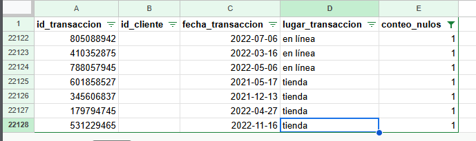
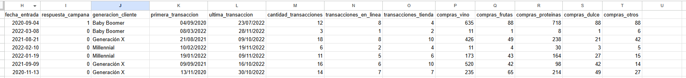

# Proyecto de Análisis de Datos.
## Segmentación Proyecto 1 

### Objetivos:

Preparar la información de la base de datos y aplicar la segmentación de clientes a través de RFM, entender el resultado de la segmentación  y sacar conclusiones que posibiliten a la empresa a tomar decisiones, las cuales son requeridas por parte de la empresa para mantener y aumentar sus ingresos, además buscar información importante que se encuentra oculta en los datos.

### Equipo:

Describe si trabajaste en dupla o individualmente.

### Herramientas y Tecnologías:

* Hojas de cálculo Excel
* OpenAI - ChatGPT

### Procesamiento y análisis:

#### Procesamiento

* Antes de la exploración de datos, se importan los datos de los tres data_sets recibidos en un solo documento con la formula IMPORTRANGE.
* Una vez realizada la importación de datos, se procede a la busqueda de nulos para tomar decisiones acerca de estos.
* Para los data_set clientes, transacciones, y resumen se agregará una columna adicional para la formula "countblank" y así poder determinar con mejor exactitud cuales acciones tomar
    * Para el data_set clientes, la categoria ingreso_anual_dolar tiene un total de 24 clientes con esta información en nulo, en este data_set, para no eliminar a los clientes, se establecerá un valor de -1 de forma que:
        - Todos los clientes que tengan valor -1 en su ingreso_anual_dolar, se debe crear una alerta para actualizar la información del mismo. 
    * Para el data_set transacciones, existen los siguientes nulos:
    
    Los cuales, al no tener el ID del cliente ni otra fuente de datos para recuperar la información faltante, se decide omitir estos, los cuales, serán identificados con un 0 para omitir.
    * Para el data_set resumen_compras, no existe ninguna categoria con nulos. Por lo cual se trabajará con la información de todo el data set segun aplique.
    * * Para los data_sets que tienen nulos y se deben modificar a  -1 y 0 según lo explicado anteriormente, al ser data_sets importados, no se puede modificar la información dentro de ellos, por lo cual se hará una columna adicional, donde se recorra cada categoria donde están los nulos y modifique los datos a -1 o 0 según corresponda la ubicación del nulo, y se trabajará con esta columna auxiliar.
* En cuanto a los valores duplicados, se examinan los 3 data_sets, y en las categorias donde no pueden (deberían) haber duplicados, son:
    * En el data_set clientes, el valor que debería ser siempre único, es id_cliente, para este data_set, no hay valores duplicados.
    * En el data_set transacciones, el único valor que no debería estar duplicado sería, id_transacción, el cual no está duplicado.
        * id_cliente si se repite, sin embargo, es totalmente válido en este escenario.
    * En resumen_compras, el valor id_cliente, está duplicado, y para este escenario, el valor no debería de estarlo. Se podría evaluar hacer la suma de los montos, si estos fueran diferentes, pero en este caso, desde ID hasta el último dato, todo esta duplicado, por lo cual en este caso los valores duplicados si deben eliminarse, sin embargo, al tratarse de información extraida con IMPORTRANGE no se puede eliminar esto, más si se podría hacer una segunda columna auxiliar para asignarle el valor "NO" a los duplicados y asi no tomarlos en cuenta en los análisis.

* Valores fuera del alcance del análisis, para el data set transacciones, las transacciones que no tengan id_cliente, son valores fuera del alcance del análisis.

Para cambiar los valores a -1 en el data set donde corresponde la sustitución de la información por lo valores nulos, se utiliza una función que recorra y corrobore donde hay nulos para sustituirlos por los valores comentados.
Para el data set tranasacciones, se realiza una query que traiga los datos del origen sin los nulos.
=QUERY(IMPORTRANGE("https://docs.google.com/spreadsheets/d/1dD2UF-XPWjPu7pkApGCQ1uIIVA0gAcZ-Qk4LPmxX10A/edit","transacciones!A:D"), "SELECT * WHERE Col1 IS NOT NULL AND Col2 IS NOT NULL AND Col3 IS NOT NULL AND Col4 IS NOT NULL", 1)

Para el data set resumen compras, se utiliza la función UNIQUE para eliminar los valores duplicados a nivel vista, ya que no estaremos trabajando con ellos, y son iguales de principio a fin.

=UNIQUE(IMPORTRANGE("https://docs.google.com/spreadsheets/d/1Tkg0lYsAiwu6CB6slktwUMdayWTvBq80SyX16r-xEVA/edit","resumen_compras!A:G"))

Otro valor fuera del alcance del análisis sería el id_transaccion, ya que es un dato no requerido para el análisis.

##### Nuevas variables:

* categoria_salario: es la promediación de los salarios para conocer en cual rango salarial está nuestro cliente
* generacion_cliente: define generación del cliente según el año de nacimiento
* primera_transaccion: fecha según registros de que el cliente hizo la primera transacción con nosotros
* ultima_transaccion: última fecha de transacción del cliente en el negocio
* cantidad_transacciones: cantidad total de transacciones del cliente en el negocio
* transacciones_en_linea: cuantas transacciones del cliente han sido en linea
* transacciones_tienda: cuantas transacciones del cliente han sido en tienda
* valor_monetario: valor total de las compras hechas por el cliente
* compras_proteinas: sumatoria de compras de pescado + pollo.

##### Unificación de tablas

En la unificación de tablas se muestra la información para medir la frecuencia, cuan reciente y valor monetario por cliente, sumando, también para poder brindarle a la empresa una información más completa acerca de donde poner los refuerzos, lo que sería la generación del cliente. 

### Resultados y Conclusiones:

Presenta los principales resultados obtenidos a partir del análisis de datos.
Resume las conclusiones extraídas del proyecto, incluyendo ideas importantes, descubrimientos relevantes y posibles recomendaciones.

### Limitaciones/Próximos Pasos:

Identifica y describe cualquier limitación o desafío encontrado durante el proyecto.
Sugiere posibles próximos pasos para extender o mejorar el proyecto de análisis de datos.

### Enlaces de interés:

Incluye el enlace a la hoja de cálculo donde desarrollaste el proyecto y/o un enlace a tu dashboard (marco 3), además de otros recursos creados para este proyecto que consideres interesante compartir.

